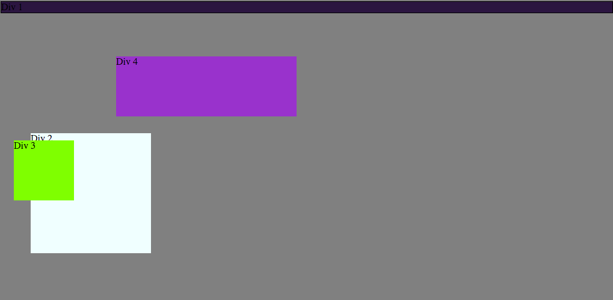
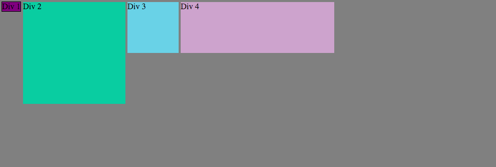
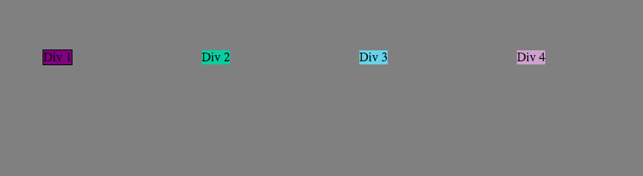
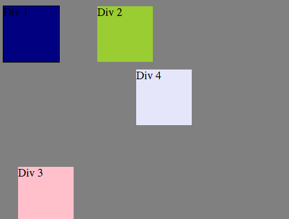
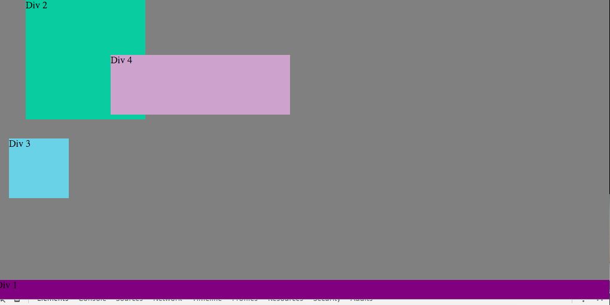
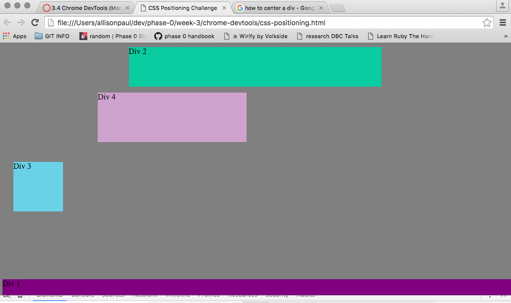
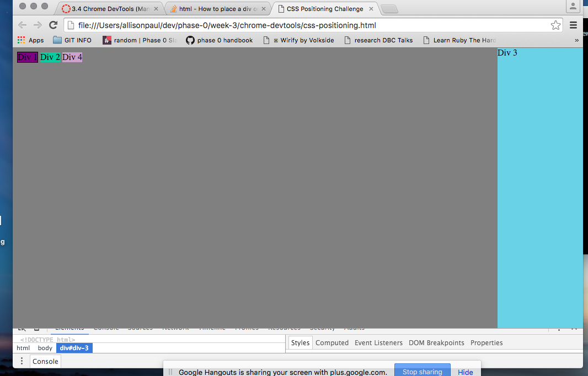
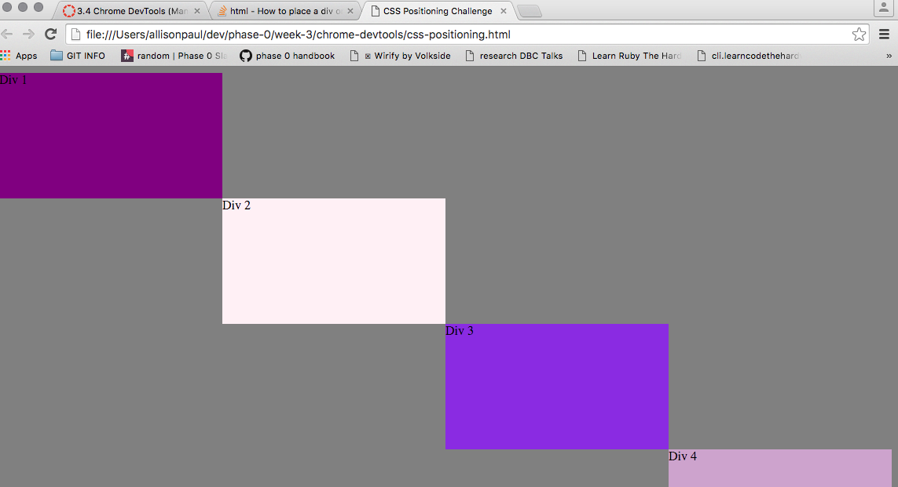

<b>How can you use Chrome's DevTools inspector to help you format or position elements?</b> 

Devtool is useful because it shows all the margins, paddings, so on in that nice box.  It gives you a visual so you don't have to guess on numbers, or what needs to be edited.  I also really loved that I could check and uncheck things I wanted to try out. It made it so easy to see what the right code was. 

<b>How can you resize elements on the DOM using CSS?</b> 

We resized all our elements using width and height under the style tab.  I'm not sure if this is the quickest or fanciest way to go about this, but it always worked. 
 

<b>What are the differences between absolute, fixed, static, and relative positioning? Which did you find easiest to use? Which was most difficult?</b> 

  Static is the default position for elements which just means all the elements will flow as a normal page in the order that you placed them. You don't really ever set somethings position to static. 
  Relative is probably what I find the most confusing and consider it just trial and error at this point.  From what I understand, when you use relative you set values (top, bottom, left, right for example) and these shift the element x amount to where it normally would have been.  
  Fixed positioning moves an element relative to the viewport, so it stays in the same place even when you scroll. I used this to set my nav bar on my website, but I haven't really used it anywhere else. I would say this is kind of rare, but not neccesarily hard to use. 
  Absolute positioning lets you place an element anywhere on the page by using values  top, bottom, left, and right. It's tricky to use though because it can easily mess up the flow of your page.  
  
   
<b>What are the differences between margin, border, and padding?</b> 

The padding is the area outside the content that is still inside the border.  When you adjust the content, you move the item within the border. The padding is always transparent. 

The margin is the area around the element.  By adjusting this you push other elements further away or closer to the element you are editing. 

A border goes around the padding and content.
 

<b>What was your impression of this challenge overall? (love, hate, and why?)</b> 

This challenge was fun but I didn't love it or really learn how devtools is useful. I don't really feel like I will use dev tools at this point in time, and I don't think I learned that much.  I did really like working with my partner and we discussed things like margin, padding, positing, and sizing elements and he taught me to see things in a new way, so for that I liked the challenge. 
