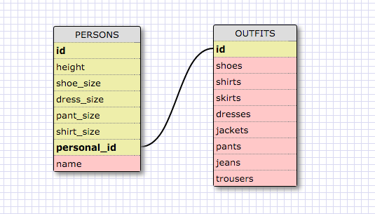

###8.4 Intro to Database Schemas and SQL 

1. Select all data for all states.

```SELECT * FROM states;```

2. Select all data for all regions.

```SELECT * FROM regions;```

3. Select the state_name and population for all states.

```SELECT state_name, population
FROM states;```

4. Select the state_name and population for all states ordered by population. The state with the highest population should be at the top.

```SELECT state_name, population
FROM states
ORDER BY population DESC;```

5. Select the state_name for the states in region 7.

```SELECT state_name
FROM states
WHERE region_id = 7;```

6. Select the state_name and population_density for states with a population density over 50 ordered from least to most dense.

```SELECT state_name, population_density
FROM states
WHERE population_density > 50
ORDER BY population_density ASC;```

 7. Select the state_name for states with a population between 1 million and 1.5 million people.

```SELECT state_name
FROM states
WHERE population
BETWEEN 1000000 AND 1500000;```

8. Select the state_name and region_id for states ordered by region in ascending order.

```SELECT state_name, region_id
FROM states
ORDER BY region_id ASC;```

9. Select the region_name for the regions with "Central" in the name.

```SELECT region_name FROM regions
WHERE region_name LIKE '%Central%';```

10. Select the region_name and the state_name for all states and regions in ascending order by region_id. Refer to the region by name. (This will involve joining the tables).

```SELECT regions.region_name, states.state_name FROM regions JOIN states ON states.region_id = regions.id ORDER BY region_id ASC;```


##SCHEMA



##REFLECT


***What are databases for?***


  Databases are for storing information in a structured/ accesible way.


***What is a one-to-many relationship?***


"One-to-many" is a relationship where 1 entity can have more than another entity.
Each row in the table can be related to many rows in the relating table.


***What is a primary key? What is a foreign key? How can you determine which is which?***


  A primary key is a column that serves a unique indentifier for a row in the table.
  
  A foreign key is a column that contains the primary key to another table in the database. It is used to identify a particular row in the referenced table.


  -Primary keys can't be null, foreign keys can.
  
  -You can only have one primary key in a table but can have multiple foreign keys.
  
  -Primary key uniquely indentify a record in the table.


***How can you select information out of a SQL database? What are some general guidelines for that?***


  You select information with a query. The basic syntax is
  ``` SELECT column_name FROM table_name;```

you can then add addition statements to narrow your search.
