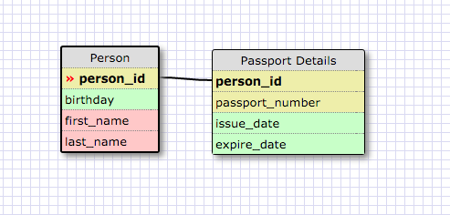

<b>Why is this a one-to-one relationship?</b>

This is a one to one relationship because the relationship only exists when any given row in person can only have one matching row in passport details. One person can't have more than one passport (in North America) and one passport can't have more than one owner.

<b>What is a one-to-one database?</b>

A one to one database is where each row in one table is linked to one and only one row in another table.

<b>When would you use a one-to-one database? (Think generally, not in terms of the example you created).</b>

You would use a one to one database when there is a row that might have empty cells in the other table. They are like optional attributes that we can use if another attribute has them, but it will avoid having a lot of empty entries.  This is quite hard for me to explain!

<b>What is a many-to-many database?</b>

A many-to-many database is when rows in a table can map to multiple rows in another table and then that table can also map to multipe rows in the first table.

<b>When would you use a many-to-many database? (Think generally, not in terms of the example you created).</b>

You use a many to many database when you have a lot of information that can related to each other.

<b>What is confusing about database schemas? What makes sense?</b>
I still find schemas pretty confusing over all.  It makes sense when I read about the relationships and WHY each one would be what relationship, but when it is time to implement the schema I get confused about keys.
